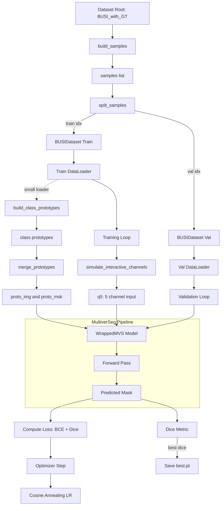

```mermaid
flowchart TD

%% ========================
%%  DATASET / SAMPLES
%% ========================
A1[Dataset Root: BUSI_with_GT]
A1 --> A2[build_samples]
A2 --> A3[samples list]

A3 --> A4[split_samples]
A4 -->|train idx| A5[BUSIDataset Train]
A4 -->|val idx| A6[BUSIDataset Val]

A5 --> D1[Train DataLoader]
A6 --> D2[Val DataLoader]

%% ========================
%%  PROTOTYPES
%% ========================
D1 -. small loader .-> P1[build_class_prototypes]
P1 --> P2[class prototypes]
P2 --> P3[merge_prototypes]
P3 --> PM[proto_img and proto_msk]

%% ========================
%%  MODEL
%% ========================
PM --> M1[WrappedMVS Model]
subgraph MVS [MultiverSeg Pipeline]
    M1 --> M2[Forward Pass]
    M2 --> M3[Predicted Mask]
end

%% ========================
%%  TRAINING
%% ========================
D1 --> T1[Training Loop]
T1 --> T2[simulate_interactive_channels]
T2 --> T3[q5: 5 channel input]
T3 --> M1
M3 --> T4[Compute Loss: BCE + Dice]
T4 --> T5[Optimizer Step]
T5 --> T6[Cosine Annealing LR]

%% ========================
%%  VALIDATION
%% ========================
D2 --> V1[Validation Loop]
V1 --> M1
M3 --> V2[Dice Metric]

%% ========================
%%  CHECKPOINT
%% ========================
V2 -->|best dice| C1[Save best.pt]


```
