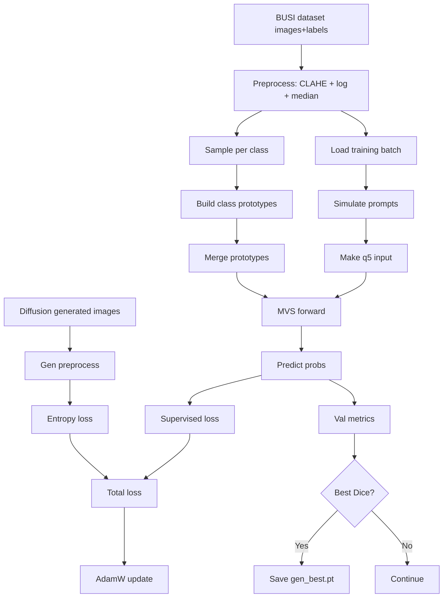

```mermaid
flowchart TD

%% ===== Data Preparation =====
A1[BUSI dataset images+labels]
A2[Diffusion generated images]

A1 --> A3[Preprocess: CLAHE + log + median]
A2 --> A4[Gen preprocess]

%% ===== Prototype Building =====
A3 --> B1[Sample per class]
B1 --> B2[Build class prototypes]
B2 --> B3[Merge prototypes]

%% ===== Prompt Simulation =====
A3 --> C1[Load training batch]
C1 --> C2[Simulate prompts]
C2 --> C3[Make q5 input]

%% ===== MultiverSeg Forward =====
C3 --> D1[MVS forward]
B3 --> D1
D1 --> D2[Predict probs]

%% ===== Loss =====
D2 --> E1[Supervised loss]
A4 --> E2[Entropy loss]
E1 --> F1[Total loss]
E2 --> F1

%% ===== Optimization =====
F1 --> G1[AdamW update]

%% ===== Validation =====
D2 --> H1[Val metrics]
H1 --> H2{Best Dice?}
H2 -->|Yes| H3[Save gen_best.pt]
H2 -->|No| H4[Continue]
```
