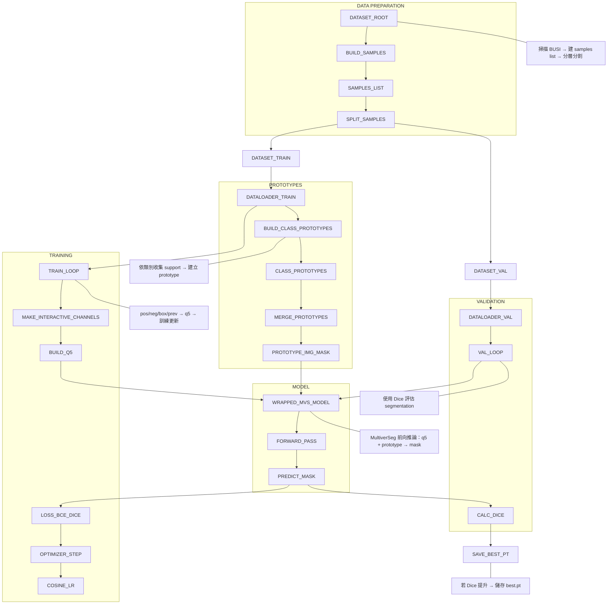

```mermaid
flowchart TD

%% ========================
%% 1. Data Preparation
%% ========================
subgraph DATA [DATA PREPARATION]
A1[DATASET_ROOT]
A1 --> A2[BUILD_SAMPLES]
A2 --> A3[SAMPLES_LIST]
A3 --> A4[SPLIT_SAMPLES]
end

A4 --> D1_TRAIN[DATASET_TRAIN]
A4 --> D2_VAL[DATASET_VAL]

D1_TRAIN --> DL1[DATALOADER_TRAIN]
D2_VAL  --> DL2[DATALOADER_VAL]

A1 --- Z1["掃描 BUSI → 建 samples list → 分層分割"]

%% ========================
%% 2. Prototypes
%% ========================
subgraph PROTO [PROTOTYPES]
DL1 --> P1[BUILD_CLASS_PROTOTYPES]
P1 --> P2[CLASS_PROTOTYPES]
P2 --> P3[MERGE_PROTOTYPES]
P3 --> PM[PROTOTYPE_IMG_MASK]
end

P1 --- Z2["依類別收集 support → 建立 prototype"]

%% ========================
%% 3. Model
%% ========================
subgraph MODEL [MODEL]
PM --> M1[WRAPPED_MVS_MODEL]
M1 --> M2[FORWARD_PASS]
M2 --> M3[PREDICT_MASK]
end

M1 --- Z3["MultiverSeg 前向推論：q5 + prototype → mask"]

%% ========================
%% 4. Training Loop
%% ========================
subgraph TRAIN [TRAINING]
DL1 --> T1[TRAIN_LOOP]
T1 --> T2[MAKE_INTERACTIVE_CHANNELS]
T2 --> T3[BUILD_Q5]
T3 --> M1
M3 --> T4[LOSS_BCE_DICE]
T4 --> T5[OPTIMIZER_STEP]
T5 --> T6[COSINE_LR]
end

T1 --- Z4["pos/neg/box/prev → q5 → 訓練更新"]

%% ========================
%% 5. Validation
%% ========================
subgraph VAL [VALIDATION]
DL2 --> V1[VAL_LOOP]
V1 --> M1
M3 --> V2[CALC_DICE]
end

V1 --- Z5["使用 Dice 評估 segmentation"]

%% ========================
%% 6. Checkpoint
%% ========================
V2 --> C1[SAVE_BEST_PT]

C1 --- Z6["若 Dice 提升 → 儲存 best.pt"]
```

